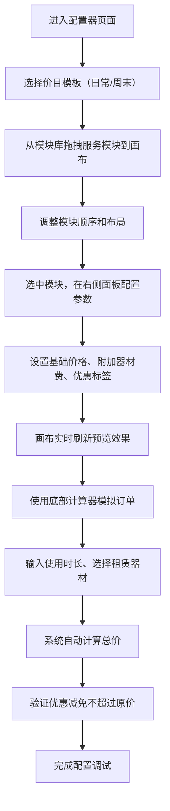

## 1. 产品概述

射箭馆箭道服务项目价目可视化配置器是一款面向射箭场馆工作人员的在线价目表编辑与预览工具。工作人员可通过拖拽方式自由排版箭道体验、器材租赁、多人套餐等服务模块，实时预览线下立式价目表的完整展示效果，并支持模拟订单金额计算。

- 目标用户：射箭场馆运营人员、前台工作人员
- 核心价值：可视化配置价目表、实时预览效果、快速计算订单金额
- 使用场景：场馆门口公示牌价目设计、日常/周末价格切换、订单金额快速核算

## 2. 核心功能

### 2.1 用户角色
| 角色 | 登录方式 | 核心权限 |
|------|----------|----------|
| 场馆工作人员 | 无需登录，直接使用 | 配置价目表、预览效果、计算订单 |

### 2.2 功能模块
1. **价目表画布区**：立式价目表预览画布、服务模块拖拽排版、实时刷新展示
2. **右侧配置面板**：项目基础收费设置、附加器材费用配置、活动优惠标签编辑
3. **订单计算器**：模拟箭道使用时长输入、租赁器材组合选择、实时总价计算
4. **模板切换**：日常/周末两套价目模板一键切换

### 2.3 页面详情
| 页面名称 | 模块名称 | 功能描述 |
|----------|----------|----------|
| 主页面 | 顶部工具栏 | 日常/周末模板切换按钮、当前模式显示 |
| 主页面 | 左侧模块库 | 箭道体验、器材租赁、多人套餐等可拖拽模块列表 |
| 主页面 | 中央画布区 | 立式价目表预览画布，支持模块拖拽排序和位置调整 |
| 主页面 | 右侧配置面板 | 选中项目的详细配置：名称、价格、附加费、优惠标签 |
| 主页面 | 底部计算器 | 时长输入、器材选择、优惠减免、总价实时计算 |

## 3. 核心流程

## 4. 用户界面设计

### 4.1 设计风格
- 主色调：深绿色（#1a4d2e）搭配金色（#d4af37），体现射箭运动的专业与优雅
- 辅助色：米白色背景、深灰色文字
- 按钮风格：圆角矩形按钮，主按钮为深绿底金色文字
- 字体：标题使用衬线字体（Noto Serif SC），正文使用无衬线字体（Noto Sans SC）
- 布局风格：三栏布局，左侧模块库、中央画布、右侧配置面板
- 图标风格：线性图标，统一使用 lucide-react

### 4.2 画布设计
- 画布比例：立式公示牌标准尺寸（约 2:3 宽高比）
- 画布背景：米白色底，深色边框模拟实体价目牌
- 模块卡片：带阴影的卡片式设计，支持拖拽
- 优惠标签：角标样式，红底白字或金底深色字

### 4.3 响应式设计
- 桌面端优先设计，最小支持 1280px 宽度
- 画布区域保持固定比例，自适应容器宽度
- 配置面板内容支持垂直滚动

### 4.4 动效设计
- 模块拖拽时的半透明跟随效果
- 配置修改后画布内容的平滑过渡
- 价格数字变化的滚动动画
- 按钮和输入框的 hover 微动效
