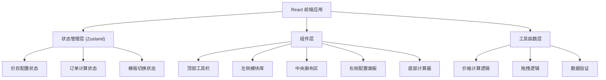

## 1. 架构设计



## 2. 技术描述

- **前端框架**：React@18 + TypeScript
- **构建工具**：Vite@5
- **样式方案**：TailwindCSS@3
- **状态管理**：Zustand
- **图标库**：lucide-react
- **后端**：无（纯前端应用）
- **数据库**：无（数据保存在内存中）

## 3. 路由定义

| 路由 | 用途 |
|------|------|
| / | 主页面，包含价目配置器全部功能 |

## 4. 数据模型

### 4.1 服务项目类型
```typescript
interface ServiceItem {
  id: string;
  type: 'lane' | 'equipment' | 'package';
  name: string;
  basePrice: number;
  unit: 'hour' | 'set' | 'person' | 'item';
  description: string;
  equipmentOptions?: EquipmentOption[];
  discountTag?: DiscountTag;
  position: number;
}
```

### 4.2 附加器材选项
```typescript
interface EquipmentOption {
  id: string;
  name: string;
  price: number;
  unit: string;
  selected: boolean;
}
```

### 4.3 优惠标签
```typescript
interface DiscountTag {
  enabled: boolean;
  text: string;
  type: 'sale' | 'hot' | 'new' | 'custom';
  color: string;
}
```

### 4.4 价目模板
```typescript
interface PriceTemplate {
  id: 'weekday' | 'weekend';
  name: string;
  items: ServiceItem[];
}
```

### 4.5 订单计算状态
```typescript
interface OrderState {
  selectedItemId: string | null;
  duration: number;
  selectedEquipment: string[];
  discountAmount: number;
  originalPrice: number;
  finalPrice: number;
}
```

## 5. 核心功能模块

### 5.1 拖拽排序
- 使用 HTML5 原生 Drag and Drop API 实现
- 支持从模块库拖拽到画布
- 支持画布内模块重新排序

### 5.2 价格计算逻辑
- 基础价格 × 使用时长
- 累加已选器材费用
- 应用优惠减免（不超过原价）
- 实时计算更新

### 5.3 模板切换
- 日常/周末两套独立数据
- 切换时保留当前编辑状态
- 画布实时刷新展示

### 5.4 实时预览
- 所有配置修改即时反映到画布
- 使用 React 状态驱动视图更新
- 动画过渡效果提升体验
